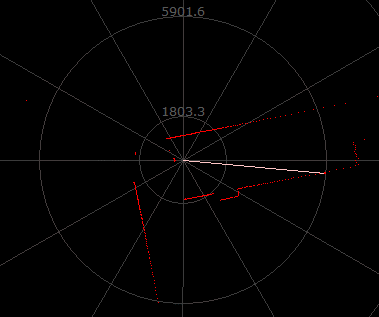

# 激光雷达

激光雷达可以获取周围的环境信息，广泛应用在无人驾驶车上。



这个项目是参照思岚科技激光雷达 SDK 在 RT-Thread 上的实现。官方 SDK 使用 C++，并使用了 STL 和一些 C++11 特性，而这个是用 C 实现的，官方的 SDK 可以从[这里](http://www.slamtec.com/cn/Support#rplidar-a-series)下载。

## 使用说明

思岚科技的激光雷达是使用串口通信 (**当前 SDK 只实现了串口，TCP 还没实现，因为我测试用的 A1 不支持 TCP**)，选中软件包后默认使用 uart3，也可以在 menuconfig 界面修改，上电初始化后在 msh 里面 list_device 应当就可以看到 rplidar 设备。

```
msh > list_device

device           type         ref count
-------- -------------------- ----------
rplidar  Miscellaneous Device 0
uart3    Character Device     1
uart2    Character Device     2
pin      Miscellaneous Device 0
```

由于激光雷达被挂载为一个设备，所以可以直接使用 RT-Thread 的设备框架 API 控制，也可以使用我二次封装后更直观的 API，数据结构和官方 SDK 是一模一样的。

## 实例代码

以获取设备健康信息为例：

```
// 创建激光雷达设备
rt_device_t lidar = rp_lidar_create(“uart3”)

// 激光雷达初始化
rp_lidar_init(lidar)

// 为雷达健康数据分配内存
rplidar_response_device_health_t* health = (rplidar_response_device_health_t*) rt_malloc(sizeof(rplidar_response_device_health_t));

// 获取激光雷达健康数据
rp_lidar_get_health(lidar, health);
```

> 由于我身边只有 RPLIDAR A1，所有例程都是用它测试的，不过根据官方文档，A系列通信协议基本都是一样的，欢迎使用其他型号测试提 issue 或 PR


## 联系方式

- 维护：Wu Han
- 主页：[http://wuhanstudio.cc](http://wuhanstudio.cc/)
- 邮箱：[wuhanstudio@hust.edu.cn](mailto:wuhanstudio@hust.edu.cn)